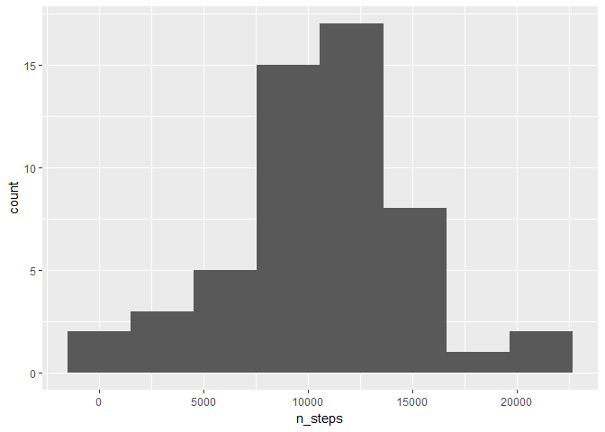
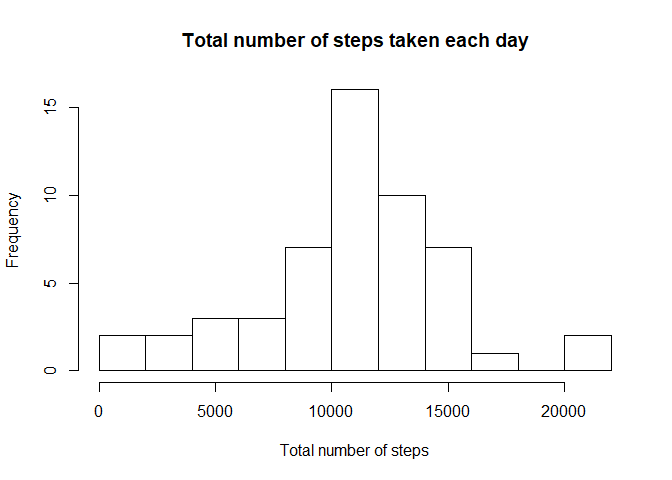
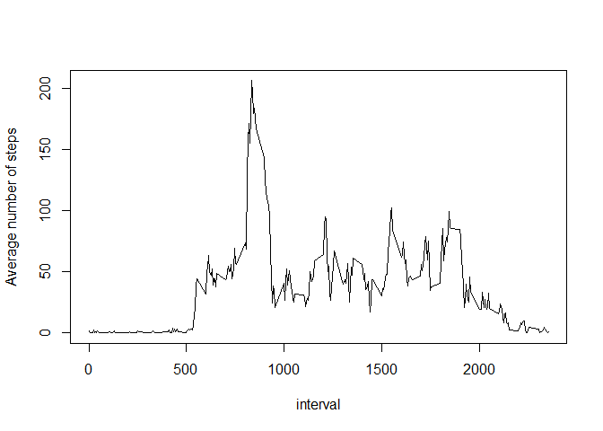
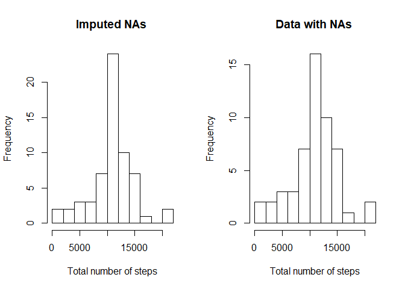

# Peer Graded Assessment_Coursera Course
Konstantinos  
23 December 2017  


## Intro
It is now possible to collect a large amount of data about personal movement using activity monitoring devices such as a Fitbit, Nike Fuelband, or Jawbone Up. These type of devices are part of the "quantified self" movement -- a group of enthusiasts who take measurements about themselves regularly to improve their health, to find patterns in their behavior, or because they are tech geeks. But these data remain under-utilized both because the raw data are hard to obtain and there is a lack of statistical methods and software for processing and interpreting the data.

This assignment makes use of data from a personal activity monitoring device. This device collects data at 5 minute intervals through out the day. The data consists of two months of data from an anonymous individual collected during the months of October and November, 2012 and include the number of steps taken in 5 minute intervals each day.

## Loading and preprocessing the data


```r
library(dplyr)
library(ggplot2)
library(knitr)
Sys.setlocale("LC_ALL","English")
```

```
## [1] "LC_COLLATE=English_United States.1252;LC_CTYPE=English_United States.1252;LC_MONETARY=English_United States.1252;LC_NUMERIC=C;LC_TIME=English_United States.1252"
```

```r
ds <- read.csv("activity.csv")
ds$date <- as.Date(ds$date)
```

## What is mean total number of steps taken per day?


```r
histdata = na.omit(ds)  %>% group_by(date)  %>% summarise(n_steps = sum(steps)) 
# simple ggplot
ggplot(histdata)+geom_histogram(aes(n_steps),bins = 8)
```

<!-- -->

```r
#base plot
hist(histdata$n_steps,
     main = 'Total number of steps taken each day',
     xlab = 'Total number of steps',
     breaks = 8)
```

<!-- -->


```r
data.frame(mean = mean(histdata$n_steps),median = median(histdata$n_steps))
```

```
##       mean median
## 1 10766.19  10765
```

## What is the average daily activity pattern?

```r
ques2 = ds  %>%
  group_by(interval)  %>% 
  summarise(avg_steps = mean(steps,na.rm = T))

with(ques2,
     plot(avg_steps~interval,
          type = 'l',
          ylab = 'Average number of steps'))
```

<!-- -->


```r
ques2[which.max(ques2$avg_steps),]
```

```
## # A tibble: 1 x 2
##   interval avg_steps
##      <int>     <dbl>
## 1      835  206.1698
```

## Imputing missing values with linear regression model

- Number of NAs

```r
length(ds[is.na(ds$steps),1])
```

```
## [1] 2304
```

- First, I run a linear regression model with `lm()`
- Then use 'date' and 'interval' to predict 'steps' with NAs

```r
ds2 = ds
imput_model = lm(steps~.,ds2 )

ds2[is.na(ds2$steps),1] = predict(imput_model,ds2[is.na(ds2$steps),c(2,3)])
```


```r
histdata2 = ds2  %>% group_by(date)  %>% summarise(n_steps = sum(steps)) 

par(mfrow=c(1,2))
hist(histdata2$n_steps,
     main = 'Imputed NAs ', 
     xlab = 'Total number of steps',
     breaks = 8)

hist(histdata$n_steps,
     main = 'Data with NAs ', 
     xlab = 'Total number of steps',
     breaks = 8)
```

<!-- -->

## Weekdays vw Weekends

```r
ds2 = ds2 %>%
  mutate(days = weekdays(date)) %>% 
  mutate(days = ifelse(days %in% c("Saturday","Sunday"),
                       'weekend',
                       'weekday')) %>% 
  mutate(days=as.factor(days))

last= ds2  %>%
  group_by(interval,days)  %>% 
  summarise(avg_steps = mean(steps))

ggplot(last,
       aes(x=interval,
           y=avg_steps)) + 
  facet_wrap(~days,
             nrow = 2) +
  geom_line() +
  theme_dark() + 
  ylab("Average Steps")
```

<!-- -->

